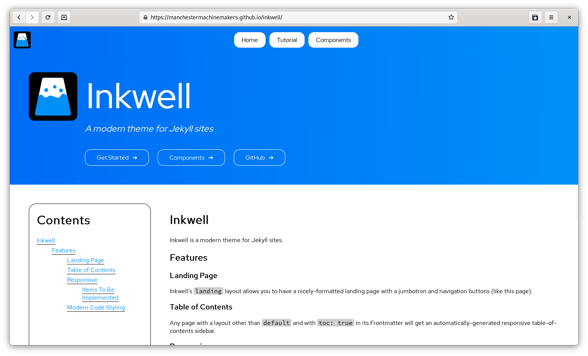
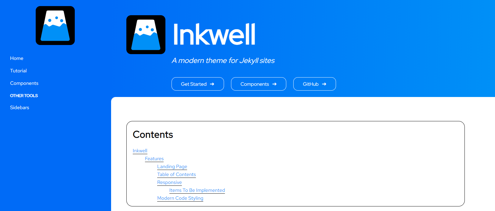

# Inkwell Jekyll Theme
Inkwell is a modern Jekyll theme for GitHub Pages, made by Aleks Rutins and the Manchester Machine Makers.

## Getting Started
Check out [the tutorial](https://aleksrutins.github.io/inkwell/tutorial).

TL;DR:
```yaml
remote_theme: aleksrutins/inkwell
```

## What does it look like?

Or, with a sidebar:

See it [here](https://aleksrutins.github.io/inkwell).

## What font is this?
[Red Hat](https://redhatofficial.github.io/RedHatFont/).